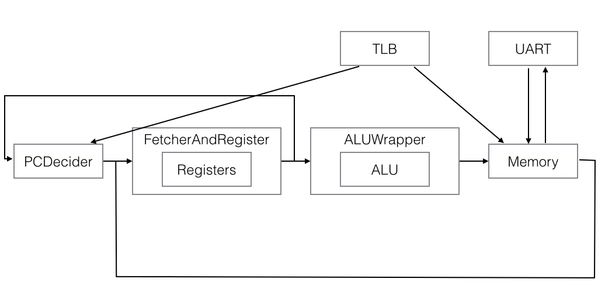

% 奋战20天，造台计算机

# 概述

我们实现了一个支持MIPS32指令集的、采用五段流水线结构的CPU，支持TLB、异常、系统调用。
另外，我们对监控程序做了些许修改，并使用Python重写了一个简易的终端使其可以在多平台上使用。

# CPU实现细节

## 流水线结构

### PCDecider

- 主要输入信号：hold，JUMP_true，JUMP_addr
- 主要输出信号：PC
- 相连模块：TLB
- 相连外部接口：两片SRAM的地址总线

若hold为真时不改变PC值，否则根据JUMP_true判断是否跳转产生新的PC值，通过TLB模块获得该指令地址的物理地址，
并给SRAM以地址，输出新的PC值。

### FetcherAndRegister

- 主要输入信号：PC，寄存器写回相关
- 主要输出信号：hold，JUMP_true，JUMP_addr，ALU信号，内存信号，寄存器写信号
- 相连模块：Registers
- 相连外部接口：SRAM数据总线

该模块从SRAM的数据总线获得指令并译码，相应的给出指令需要的ALU、内存、寄存器读写信号。对于读寄存器的操作，通过Registers读取数据并将数据输出。

另外，该模块还会判断跳转、hold（气泡）、PC异常、TLB异常的情况并给出JUMP_addr、hold等。

### ALUWrapper

- 主要输入信号：ALU信号，内存信号，寄存器写信号
- 主要输出信号：ALU输出，内存信号，寄存器写信号
- 相连模块：TLB

该模块根据前一级的信号完成算术逻辑运算，将其他信号继续传递给下一级。并且将为内存地址的计算结果通过TLB转换后得到物理内存地址，若TLB未找到则传递信号给FecherAndRegister由它产生异常。

### Memory

- 主要输入信号：ALU输出，内存信号，寄存器写信号
- 主要输出信号：内存读取输出，寄存器写信号
- 主要相连模块：UART，数码管
- 相连外部接口：SRAM的地址、数据总线

该模块与前一级ALUWrapper以及FetcherAndRegister相连，根据前一级的信号完成内存读写，读写特定地址时改为从UART模块、数码管模块读写，并将写寄存器信号传回至FetcherAndRegister。

## 寄存器数据冲突的处理

当写寄存器指令执行后的三个周期内，若遇到对同一个寄存器的读操作，由于流水线结构的特性会产生数据冲突，解决方法为：

- 使寄存器模块正确处理同时读写同一个寄存器的情况，从而解决相距三个周期的冲突
- 在译码阶段记录前两条指令是否写寄存器以及写寄存器的值，当发生数据冲突时暂停流水

## 跳转冲突的处理

- 对于jump、branch指令，由于存在延迟槽，不存在冲突
- 对于syscall、中断等，由译码阶段判断后暂停流水一个周期

## 访存结构冲突的处理

虽然我们使用的硬件包含两片SRAM，在指令和数据分别存放的情况下不存在访存的结构冲突，
但是由于我们需要实现对同一个地址空间的写指令和运行指令，因此并不采用该种方法。

由于取指令和内存数据读写可能需要对同一个SRAM操作，因此将每个CPU周期分为了4个时钟周期，在前两个周期进行取指令，在后两个周期进行数据读写。

## TLB missing

当取指、访存的地址发生TLB未找到异常时，信号会传递给译码模块，其根据不同情况暂停流水并跳到中断处理地址：

- 若取指时发生异常：产生一个周期的气泡后跳转至异常处理地址，EPC值为当前PC值
- 若数据访存时发生异常：产生一个周期的气泡后跳转至异常处理地址，EPC值为两个周期前的PC值

# Memory Map

+-------+-----------------------+------+-----------------------+
|  name |      virtual addr     | TLB? |     physical addr     |
+=======+=======================+======+=======================+
| kuseg | 0x00000000-0x7FFFFFFF | Y    |                       |
+-------+-----------------------+------+-----------------------+
| kseg0 | 0x80000000-0x9FFFFFFF | N    | 0x00000000-0x1FFFFFFF |
+-------+-----------------------+------+-----------------------+
| kseg1 | 0xA0000000-0xBFFFFFFF | N    | 0x00000000-0x1FFFFFFF |
+-------+-----------------------+------+-----------------------+
| kseg2 | 0xC0000000-0xFFFFFFFF | Y    |                       |
+-------+-----------------------+------+-----------------------+

- SRAM物理可用地址至 0x7fffff (8M)
- Kernel在0x80000000（物理地址0x000000，也即CPU起始PC地址）
- 中断处理代码在0x80008000（物理地址0x008000）
- 用户代码一般放在物理地址0x400000以上（使用TLB）
- $sp初始化至0x807FFF00（物理地址0x7fff00）

特殊的内存地址：

- UART数据地址：0xBFD003F8（TLB转化后为0x1FD003F8）
- UART控制地址：0xBFD003FC（TLB转化后为0x1FD003FC），可写时最低位置1，可读时第二低位置1
- 数码管0、数码管1分别为：0xBFD00000, 0xBFD00004
- LED: 0xBFD00008
- CGA: 0xBFD1xxyy
- BIOS: 0xBFC0xxxx
- Ethernet INT: 0xBFD00014
- Ethernet IOAddr: 0xBFD00018
- Ethernet DataAddr: 0xBFD0001C

# 监控程序

# 终端

# How to simulate

- 安装ghdl和gtkwave
- make -f Registers.makefile （仿真RegistersTestbench，或者其他几个makefile)
- open Registers.vcd （波形文件）
